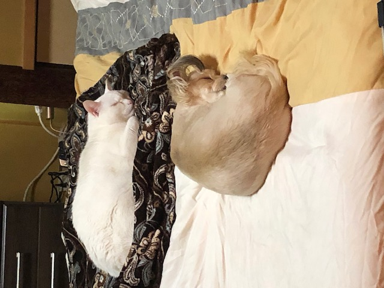

# TOPIC
## LOLITA & BIANCHI
### Lolita was born in San Diego CA, and has a disabilty in both of her legs.  The knee joints are fused together, so they don't bend like a normal dogs knee should.  The day my wife and I went to the SPCA, Lolita was in a cage by herself, and waddled up to the front of the cage.  I could see she was special by the way she walked and knew instantly the she had a disability.  I asked the attendant what was wrong and she told her condition and that she was scheduled to be put down.  I asked the attendant if I could show her to my wife and she obliged.  When I show my wife Lolita, she feel instantly in love with her.  I told her that they plan to put Lolita to sleep tonight.  My wife told the attendant that she wanted Lolita and she was more than happy to allow us to adopt her.
### Bianchi is from Hiroshima, Japan.  He was adopted from a family that had a litter of kittens.  He was so small that he fit in one hand.  My wife surprised me with Bianchi as a birthday present.  I told her that if Lolita doesn't like him, he is going back to the family.  Unfortunately for me, Lolita liked Bianchi in the begging.  When he grew to his size now, 13 lbs, she tolerates him until he wants to play with her when he was smaller.  Now Lolita will play with him until he tackles her, then she starts biting him so that he will get off of her.
### They are our little Princess & Prince of the family.

[INDEX](index.md)
